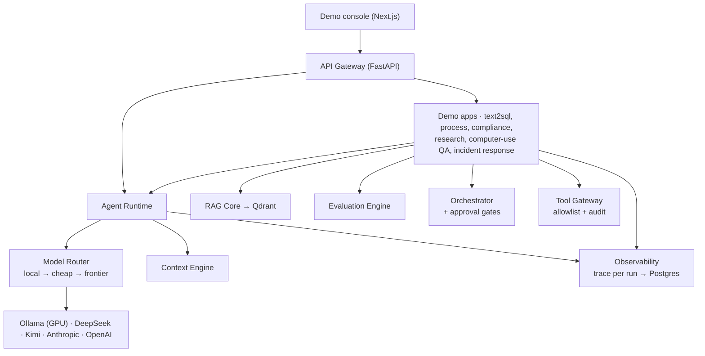

# Enterprise AI Agent Workbench

[](https://github.com/Nasferatuss/AI-agents-enterprise/actions/workflows/ci.yml)
[](LICENSE)

Service-oriented platform for building, evaluating, and operating production-grade AI agents.
One core, ten demo apps — every module demonstrates the full engineering loop:
**context → tools → reasoning → action → eval → trace → governance → demo.**

> Status: **Portfolio complete** — service-oriented core + all 10 demo modules, hardened (Phase 4 QA).
> Roadmap: MVP → **Portfolio (10 modules)** → Showcase.

## What's built

**Platform core** (`platform/`): a cost-aware **model router** (local-first: Ollama on a
GPU box → cheap APIs → frontier, with fallback), an **agent runtime** (provider-agnostic
tool-calling loop), a **context engine** (prompt assembly + compaction), a **RAG core**
(chunking, local embeddings, Qdrant, hybrid RRF search), an **evaluation engine** (retrieval
metrics, citation accuracy, LLM judges, synthetic QA), a predictable **workflow orchestrator**
(state machine + human-in-the-loop approval gates), and an **observability layer** (a trace
for every run).

**Modules (10):**
1. **Workflow Orchestrator** — predictable workflows with approval gates & audit log → `/workflows`
2. **Text-to-SQL BI Agent** — question → guarded read-only SQL → result → explanation → `/text2sql`
3. **RAG Evaluation Lab** — RAG pipeline + strict retrieval/answer evals
4. **Observability Console** — cost, latency, failure taxonomy for every run → `/observability`
5. **Business Process Investigator** — spec → entities, process map, contradictions, backlog → `/process`
6. **Compliance & Risk Reviewer** — PII + policy rules + a deterministic risk score → `/compliance`
7. **Deep Research Agent** — plan → research via a governed Tool Gateway → cited report → `/research`
8. **Guarded Computer-Use QA** — agent drives a legacy UI sandbox, reports bugs → `/qa`
9. **Synthetic Eval Generator** — corpus → eval dataset (standard/negative/multi-hop) + benchmark card
10. **Incident Response Agent** — failed traces → root-cause classification → RCA report → `/incidents`

## Architecture

Monorepo around a **Service-Oriented Core**: shared platform capabilities (RAG, evals,
observability, context engine, governance, orchestration, model routing) are platform
services — never re-implemented inside individual demo apps.



```
platform/   platform layers: shared, gateway, runtime, rag, evals, orchestrator, observability
apps/       demo modules built on top of the core (text2sql)
ui/web      Next.js demo console (3 module pages)
infra/      Docker Compose
docs/       setup, demo walkthrough, security model
wiki/       knowledge base: architecture, ADRs, roadmap, risks (Obsidian-style, Russian)
sources/    immutable source documents the wiki is built from
```

Key decisions live in `wiki/decisions/` as ADRs (service-oriented monorepo, MVP scope,
hybrid local/API model split, read-only SQL safety, custom trace schema, predictable
orchestration, model-router design, deployment topology).

## Stack

Python 3.12 / FastAPI / Pydantic · uv workspace · PostgreSQL · Qdrant · Redis · SQLAlchemy ·
sqlglot · Next.js / React / TypeScript / Tailwind · Docker Compose · hybrid local/API LLM routing.

## Quickstart

```bash
make install   # uv sync + npm install
make qa        # lint + full test suite (incl. eval regression + SQL injection)
make seed      # populate the observability console with sample runs
make up        # full stack via Docker Compose (postgres, qdrant, redis, api)
make ui        # demo console on :3000
```

## Docs

- [`docs/setup.md`](docs/setup.md) — wire up real models (local Ollama on a GPU box, or provider keys)
- [`docs/demo.md`](docs/demo.md) — 5-minute guided tour
- [`docs/deploy.md`](docs/deploy.md) — full-stack Docker + public-demo deployment
- [`docs/security.md`](docs/security.md) — threat model, controls, known limitations
- [`CHANGELOG.md`](CHANGELOG.md) · [`wiki/00_index.md`](wiki/00_index.md) — knowledge base (architecture, ADRs, roadmap, risks)

## License

MIT — see [LICENSE](LICENSE).
