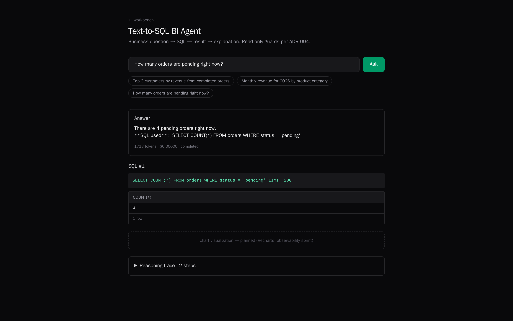
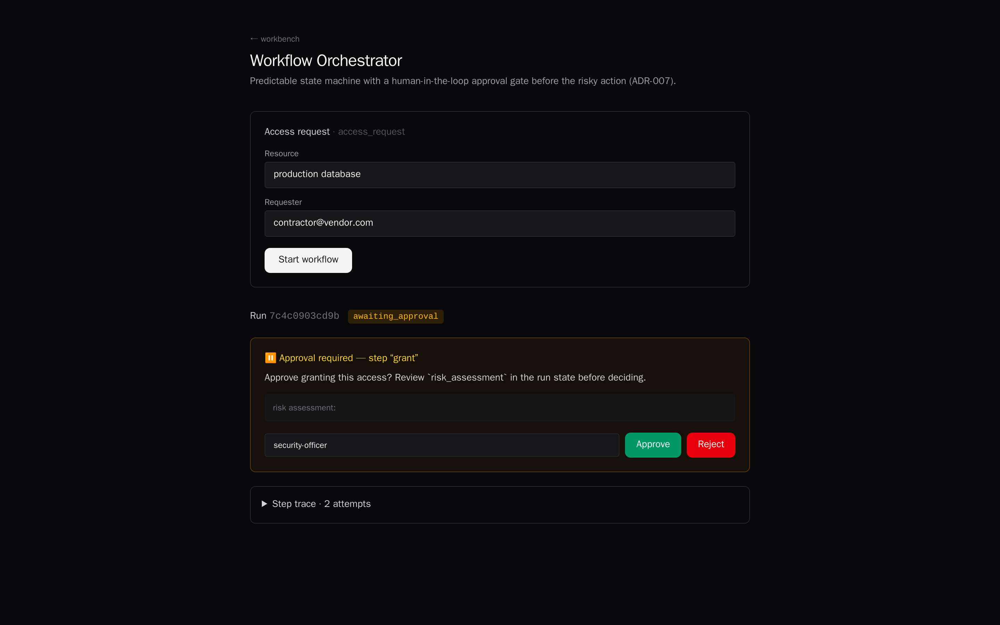
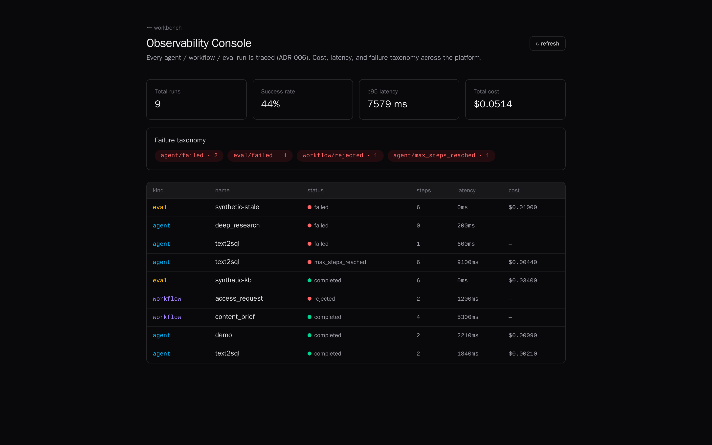
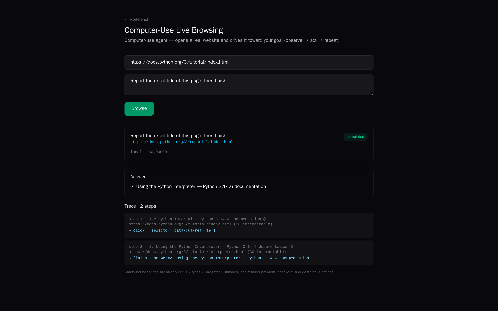
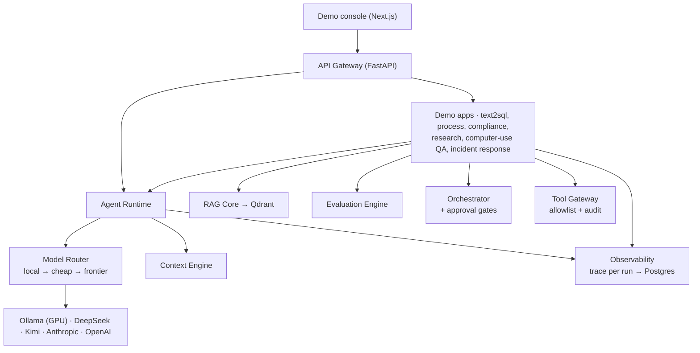

# Enterprise AI Agent Workbench

[](https://github.com/Nasferatuss/AI-agents-enterprise/actions/workflows/ci.yml)
[](LICENSE)

A **production-style reference platform** for building, evaluating, and operating AI agents:
one service-oriented core, with demo apps and flagship agents on top. Every module walks the
full engineering loop: **context → tools → reasoning → action → eval → trace → governance → demo.**

> Status: **Core + flagships, hardened.** A service-oriented platform core, 11 demo modules
> (4 deep, 5 illustrative, 3 externally-connected flagships — one shared with the Computer-Use QA
> module; see [grouping](#modules)), real web/browser/autonomous flagships,
> a published [routing benchmark](docs/benchmarks.md), and a [security model](docs/security.md)
> with SSRF/sandbox/auth hardening. 300+ network-free tests, CI, Docker Compose.
>
> *Reference platform, not a multi-tenant SaaS: the engineering practices are production-grade;
> sample data and a few external actions are scoped demo seams, called out in [What's real vs demo](#whats-real-vs-demo).*

## Demo

A guided 5-minute tour lives in **[docs/demo.md](docs/demo.md)** — it leads with the
externally-connected flagships (autonomous agent, live browser, real-web research)
and then shows the engineering rigor underneath (guarded SQL, approval-gated
workflows, per-run observability). Run it locally with `make up && make ui`.



*Text-to-SQL against the bundled retail database, answered by a local model
through the router. The `LIMIT 200` in the executed statement was not written by
the model — the SQL guard injects it (ADR-004), alongside the AST check, the
function denylist, the table allowlist and a read-only connection.*



*The orchestrator suspended at `awaiting_approval`. Control flow is deterministic
— no model output decides which step runs — and the `grant` step cannot execute
until a human approves or rejects, with the decision written to the audit log
(ADR-007).*



*Every agent, workflow and eval run is traced (ADR-006): status, step count,
latency and cost, with the failure taxonomy aggregated in SQL. The top row is
the live Text-to-SQL run above — `$0.00000` because it was served locally.*



*Real headless Chromium on `docs.python.org`, driven by a local 3B model: it
observes 30 interactable elements, clicks one, re-observes the page it landed on
and finishes with that page's exact title. `$0.00000` — served locally. The
action space is the safety boundary printed at the bottom, not a prompt
instruction. A model this small navigates but does not reliably converge on
harder goals; that ceiling is the model's, and the loop around it is the same
one a frontier model drives.*

<!-- Still to capture. The autonomous agent and deep research request the
     `complex` tier, which routes to a frontier API by design (ADR-003/008), so
     these two need a provider key. See docs/screenshots/README.md.


-->

## What's built

**Platform core** (`platform/`): a cost-aware **model router** (local-first: Ollama on a
GPU box → cheap APIs → frontier, with fallback), an **agent runtime** (provider-agnostic
tool-calling loop), a **context engine** (prompt assembly + compaction), a **RAG core**
(chunking, local embeddings, Qdrant, hybrid RRF search), an **evaluation engine** (retrieval
metrics, citation accuracy, LLM judges, synthetic QA), a predictable **workflow orchestrator**
(state machine + human-in-the-loop approval gates), and an **observability layer** (a trace
for every run).

<a id="modules"></a>
**Demo modules.** Grouped by depth so you know where to look — the deep four and the three
flagships below are the substance; the illustrative ones show a pattern end-to-end on fixtures.
(Deep Research started as a demo module and graduated into the flagship tier — see below.)

*Deep (production-shaped engineering):*
1. **Workflow Orchestrator** — predictable state machine, approval gates, audit log, durable runs → `/workflows`
2. **Text-to-SQL BI Agent** — question → guarded read-only SQL (multi-layer guard) → result → explanation → `/text2sql`
3. **RAG Evaluation Lab** — RAG pipeline + strict retrieval/answer evals + CI regression gate
4. **Observability Console** — cost, latency, failure taxonomy (SQL-aggregated) for every run → `/observability`

*Illustrative (a pattern shown on fixtures):*
5. **Business Process Investigator** — spec → entities, process map, contradictions, backlog → `/process`
6. **Compliance & Risk Reviewer** — PII + policy rules + a deterministic risk score → `/compliance`
7. **Synthetic Eval Generator** — corpus → eval dataset (standard/negative/multi-hop) + benchmark card
8. **Incident Response Agent** — failed traces → root-cause classification → RCA report → `/incidents`
9. **Guarded Computer-Use QA** — deterministic scenario runner against a bundled UI sandbox → `/qa`
   *(the live-browser version is the `/browse` flagship below)*

**Flagship agents** (deeper, externally-connected — the "wow" tier):
- 🤖 **Autonomous Agent** — `plan → act (tools) → reflect → repeat` until the goal is met, with a
  memory scratchpad. Built on the runtime tool-loop. → `/autonomous`
- 🌐 **Deep Research over the real web** — DuckDuckGo search + real page fetch & extraction, synthesized
  into a report citing **real source URLs** (opt-in: `WB_RESEARCH_LIVE_WEB=true`; falls back to the
  bundled corpus). → `/research`
- 🖥️ **Live Computer-Use** — opens a **real website** in headless Chromium and drives it toward a goal
  (`observe → act → repeat`), with a safety boundary that refuses payment/destructive actions. → `/browse`

## What's real vs demo

This is a **reference platform**, and it's deliberate about which parts are production-grade engineering
and which are scoped demos. Being explicit so reviewers know exactly what they're looking at:

**Real — production-grade engineering (the substance):**
- **Model Router** — cost-aware routing by task complexity (local → cheap → frontier) with graceful
  fallback and per-call cost accounting. Provider-agnostic; add a provider via config, not code.
- **Tool Gateway** — every tool call passes an allowlist + audit log. A real security boundary; the same
  governance wraps real MCP tools.
- **Observability** — every run (agent, workflow, eval) is traced with cost, latency, status; best-effort
  (never blocks the request). Powers the incident-response module.
- **Evaluation** — retrieval metrics + citation accuracy + **LLM-as-judge** (judged by a stronger model),
  with a **CI regression gate** that fails the build when quality drops.
- **RAG Core** — chunking, local embeddings, Qdrant, hybrid (vector + keyword) retrieval.
- **Workflow engine** — predictable state machine with retries, branching, and **human-in-the-loop
  approval gates** with a full audit trail.
- **The three flagships above** — real DuckDuckGo web research, real headless-Chromium browsing, and a real
  multi-iteration plan/act/reflect loop.
- **Engineering rigor** — 300+ network-free tests, CI (lint + tests + real-browser e2e + UI build),
  Docker Compose stack, Alembic migrations.

**Demo — illustrative fixtures & stubs (scoped on purpose):**
- **Sample data**: the Text-to-SQL database, the Computer-Use QA sandbox page, and the default research
  corpus are bundled fixtures, not production data sources.
- **Stubbed external actions** (these are the integration seams, marked in code):
  - Workflow `grant_access` returns a confirmation note — it does **not** call a real IAM system. It's where
    you'd wire AWS IAM / Okta / your provisioning API.
  - Compliance PII detection uses regex + a sample policy set (extend with your rules / classifiers).
  - The Computer-Use **QA** module runs a fixed scenario set against a bundled CRM page (the **`/browse`
    flagship**, by contrast, drives real live sites).
- **LLM providers are yours to supply** — set keys / a local Ollama endpoint in `.env`. Without them, the
  deterministic layers (PII scan, SQL guards, retrieval, scoring, routing decisions) still run.

The guiding principle throughout: **deterministic core + LLM only for narrative/reasoning.** Critical
facts (findings, scores, verdicts) are computed deterministically so they're auditable and stable; the
model explains them, it doesn't decide them.

## Architecture

Monorepo around a **Service-Oriented Core**: shared platform capabilities (RAG, evals,
observability, context engine, governance, orchestration, model routing) are platform
services — never re-implemented inside individual demo apps.



```
platform/   platform layers: shared, gateway, runtime, rag, evals, orchestrator, observability
apps/       demo modules built on the core (text2sql, process, compliance, research, cua, incident, autonomous)
ui/web      Next.js demo console (one page per module)
infra/      Docker Compose
docs/       setup, demo walkthrough, security model
wiki/       knowledge base: architecture, ADRs, roadmap, risks (Obsidian-style, Russian)
sources/    immutable source documents the wiki is built from
```

Key decisions live in `wiki/decisions/` as ADRs (service-oriented monorepo, MVP scope,
hybrid local/API model split, read-only SQL safety, custom trace schema, predictable
orchestration, model-router design, deployment topology).

## Stack

Python 3.12 / FastAPI / Pydantic · uv workspace · PostgreSQL · Qdrant · Redis · SQLAlchemy ·
sqlglot · Next.js / React / TypeScript / Tailwind · Docker Compose · hybrid local/API LLM routing.

## Quickstart

```bash
make install   # uv sync + npm install
make qa        # lint + full test suite (incl. eval regression + SQL injection)
make seed      # populate the observability console with sample runs
make bench     # cost-aware routing benchmark (stub; `make bench-live` for real providers)
make up        # full stack via Docker Compose (postgres, qdrant, redis, api)
make ui        # demo console on :3000
```

## Docs

- [`docs/ARCHITECTURE.md`](docs/ARCHITECTURE.md) — layers, request lifecycle, durability & security boundary
- [`docs/request-lifecycle.md`](docs/request-lifecycle.md) — one request end-to-end, with the real trace it writes
- [`docs/rag-eval.md`](docs/rag-eval.md) — retrieval eval report (hit_rate/MRR/precision) + the CI regression gate
- [`docs/setup.md`](docs/setup.md) — wire up real models (local Ollama on a GPU box, or provider keys)
- [`docs/demo.md`](docs/demo.md) — 5-minute guided tour
- [`docs/deploy.md`](docs/deploy.md) — full-stack Docker + public-demo deployment
- [`docs/security.md`](docs/security.md) — threat model, controls, known limitations
- [`docs/benchmarks.md`](docs/benchmarks.md) — cost-aware routing benchmark (methodology + numbers)
- [`docs/distributed.md`](docs/distributed.md) — job-queue delivery guarantees + two-worker crash/reclaim proof
- [`CHANGELOG.md`](CHANGELOG.md) · [`wiki/00_index.md`](wiki/00_index.md) — knowledge base (architecture, ADRs, roadmap, risks)

## License

MIT — see [LICENSE](LICENSE).
