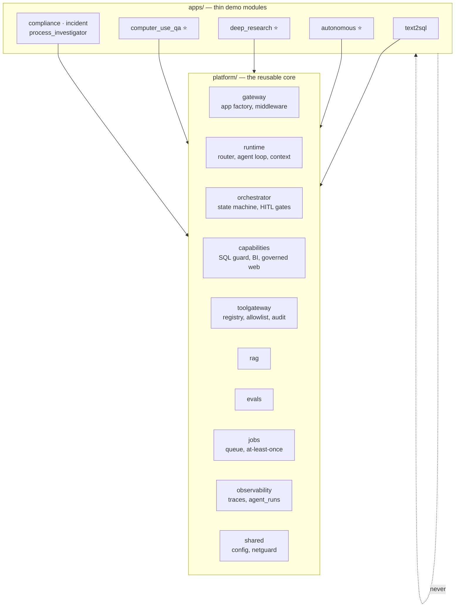
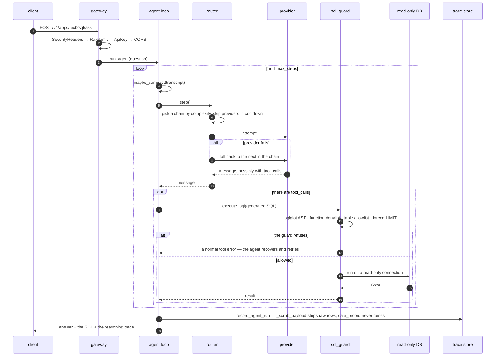
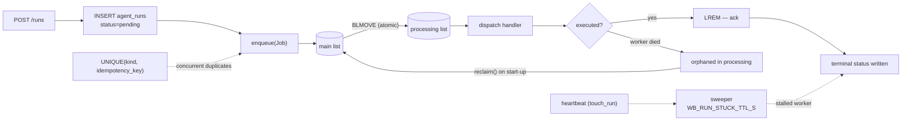

# Architecture

A map of how the Enterprise AI Agent Workbench is put together: the layers, the
path a request takes, and where durability and security live. For the reasoning
behind the decisions, see the ADRs in [`wiki/decisions/`](../wiki/decisions/);
for running it, [`README.md`](../README.md).

## Principle

**A deterministic core; the model only writes the narrative.** Scores, verdicts,
classification and guard decisions are computed in code — the model just explains
the result in human language. That is what makes the agents auditable, which is
the requirement in an enterprise context.

## Layers

A `uv` workspace monorepo in two halves:

- **`platform/`** — the reusable core (services).
- **`apps/`** — thin demo applications on top of the core (a FastAPI router plus
  an agent for each).

**The hard rule (ADR-001):** `apps` depend on `platform`, but **never on each
other**. The dependency graph is one-directional — no `apps/X` imports `apps/Y`.
Shared capabilities (the SQL guard, schema reflection, the BI engine, governed
web access) live in `platform/capabilities` so that app→app coupling never
appears.



### `platform/` — the core

| Package | Module | Responsibility |
|---|---|---|
| `platform/shared` | `workbench_shared` | Config (`WB_*`), logging, the SSRF guard (`netguard`), base schemas |
| `platform/gateway` | `workbench_gateway` | FastAPI app factory, middleware (auth/rate/headers), router mounting, worker entrypoint |
| `platform/runtime` | `workbench_runtime` | Model router (chains + fallback), agent loop, context engine, provider clients |
| `platform/orchestrator` | `workbench_orchestrator` | Deterministic workflow state machine + HITL gates, durable run registry |
| `platform/observability` | `workbench_observability` | Async trace store (`traces` + `agent_runs`), `safe_record`, sweeper |
| `platform/jobs` | `workbench_jobs` | Distributed job queue: in-process and Redis backends, at-least-once |
| `platform/capabilities` | `workbench_capabilities` | Read-only SQL guard, schema reflection, BI engine, governed web |
| `platform/toolgateway` | `workbench_toolgateway` | Tool registry + per-call allowlist + audit log, MCP client/server |
| `platform/rag` | `workbench_rag` | RAG pipeline: chunking → embeddings → Qdrant → hybrid search (dense + BM25, RRF) |
| `platform/evals` | `workbench_evals` | RAG eval: generate → answer → LLM judge → metrics → regression gate |

### `apps/` — demo

`text2sql` · `autonomous_agent` ⭐ · `deep_research` ⭐ · `computer_use_qa` ⭐ ·
`compliance_reviewer` · `incident_response` · `process_investigator`
(⭐ — the three flagships: real web, real browser, real autonomy — not stubs).

## The life of a synchronous request

Example: `POST /v1/apps/text2sql/ask`.

```
HTTP
 │
 ▼  platform/gateway/app.py — middleware, in execution order:
 │    SecurityHeaders → RateLimit → ApiKey → CORS      (auth/rate are no-ops by default)
 ▼  apps/text2sql/api.py: ask()
 │    build_agent(engine) → an Agent with the run_sql tool and the schema in its instructions
 ▼  platform/runtime/agent.py: run_agent() — loops until max_steps:
 │    maybe_compact(transcript) → router.step() → if there are tool_calls: execute_tool()
 ▼  platform/runtime/router.py: step()
 │    chain(complexity) → skip providers in cooldown → attempt → on failure, fall back to the next
 ▼  platform/capabilities/sql_guard.py: execute_sql()
 │    validate_sql() [5 layers] → run it on a read-only connection
 ▼  platform/runtime/tracing.py: record_agent_run()
      _scrub_payload() → safe_record()   (best-effort — a DB failure never fails the request)
```

The same path, showing where a request can be refused and where the model does
*not* get to decide:



The guard is code, not a prompt: a rejected query comes back to the agent as an
ordinary tool error, and the read-only connection is the boundary that holds even
if every layer above it were bypassed.

## Durable / async runs (ADR-010)

An expensive run — the autonomous agent takes minutes on a frontier model —
cannot be held inside a single HTTP request: a load balancer with a 30–60 s
timeout will cut it. The model is submit → 202 → background → poll:

- `POST /v1/apps/autonomous/runs` → `create_run` (INSERT into `agent_runs`) →
  `enqueue(Job)` → **202** with a `run_id`.
- The `_execute_run` handler runs it in the background, beats a heartbeat
  (`touch_run`) and writes a terminal status.
- `GET /v1/apps/autonomous/runs/{id}` polls the status from the durable store,
  readable from any replica.

**HITL survives a restart:** the orchestrator registry is a write-through cache
with load-on-miss; a run parked on an approval gate is rehydrated from the
database (`WorkflowRun.model_validate(payload)`).

## Distributed job queue (`platform/jobs/queue.py`)

The seam between "submit" and "execute". The backend is chosen by
`WB_JOB_BACKEND`:

- **`inprocess`** (default) — the handler runs as an asyncio task inside the
  gateway. Single replica.
- **`redis`** — `LPUSH` onto a list, with a separate worker
  (`python -m workbench_gateway.worker`) consuming it. The horizontally scalable
  path.

**The guarantee is at-least-once plus effectively-once:** `BLMOVE` moves
main→processing atomically → dispatch → `LREM` acknowledges only after execution;
`reclaim()` on start-up recovers orphaned jobs; the handler is idempotent (it
skips a run that is already terminal). In full:
[`docs/distributed.md`](distributed.md).



**The crash-recovery layers:** reclaim (a crash between pop and ack) · the
reconciler (restarting with `pending`/`running` rows) · heartbeat + sweeper (a
stalled worker) · `UNIQUE(kind, idempotency_key)` (concurrent duplicates).

## Security boundary

The primary threat is a prompt-injected model emitting a dangerous tool call. The
boundary lives **in the guards' code**, not in the prompt:

- **SSRF** (`platform/shared/netguard.py`) — `assert_public_url` resolves DNS and
  requires every resulting IP to be globally routable (private, loopback,
  link-local, metadata, CGNAT and IPv4-mapped addresses are all blocked);
  `safe_get` re-validates on every redirect hop.
- **SQL** (`platform/capabilities/sql_guard.py`) — five layers: the sqlglot AST ·
  a function denylist · a table allowlist · a forced `LIMIT` · a read-only
  connection (the real boundary).
- **File sandbox** (autonomous `tools.py`) — absolute paths, `..` traversal and
  symlink escapes are rejected; writes are capped at 100 KB.
- **Gateway** (`gateway/security.py`) — in production it fails fast without
  `WB_API_KEY` / `WB_APPROVAL_TOKEN` / an explicit CORS setting; the API-key gate
  and rate limiting are optional; security headers are always on.
- **Tool Gateway** (`platform/toolgateway/gateway.py`) — a registry plus a
  per-call allowlist; a denied call is logged and not executed.

Known limitations and the threat model: [`docs/security.md`](security.md).

## Observability

A custom trace schema rather than OpenTelemetry, for the sake of agent-domain
semantics: the router's tier decision, allowed and denied tool calls, cost per
run, provider attempts during fallback. The `traces` table carries
`kind/name/status/latency_ms/cost_usd/tokens/num_steps/error/payload`. Writing is
**best-effort** (`safe_record` inside a try/except) — telemetry is never on the
critical path; raw `rows` are stripped from the payload by `_scrub_payload`.

## Configuration

Everything is an environment variable prefixed `WB_`
(`platform/shared/config.py`, `pydantic_settings`). The important ones: `WB_ENV`
(`prod` turns on fail-fast security), `WB_API_KEY`, `WB_JOB_BACKEND`,
`WB_TRACE_DB_URL`, `WB_RUN_STUCK_TTL_S`. Provider keys (`ANTHROPIC_API_KEY` and
friends) are read directly from the environment. The full list is in `config.py`.

## Where to look (the order for someone new)

1. `platform/gateway/app.py` — the composition root, every middleware and router
   in one place.
2. `apps/text2sql/api.py` → `platform/runtime/agent.py` → `router.py` — the
   synchronous request path.
3. `apps/autonomous_agent/api.py` + `observability/runs.py` — the async/durable
   model.
4. `platform/jobs/queue.py` + `docs/distributed.md` — the delivery guarantees.
5. `netguard.py` + `capabilities/sql_guard.py` — the security boundary.
6. `wiki/decisions/` — the ADRs (*why*): 001 (the core), 008 (the router), 010
   (durable runs), 004 (SQL safety), 006 (the trace schema).

`apps/*/api.py` says *what a module does*; `platform/*` says *how*; the ADRs say
*why*; and the tests next to the code are the executable specification of the
behaviour.
